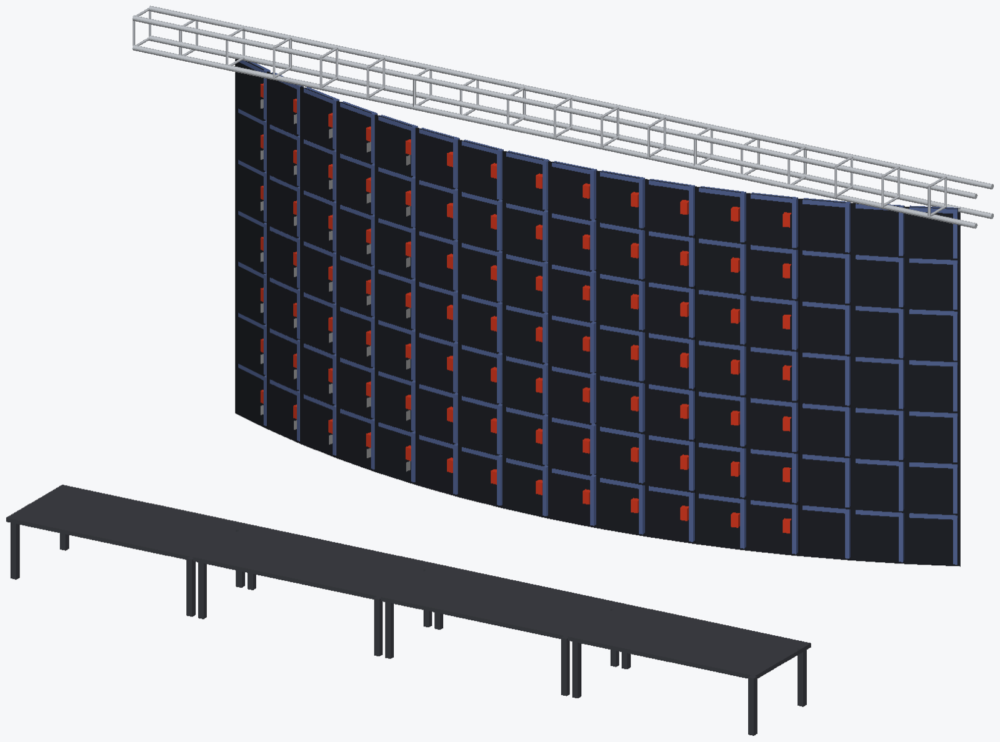
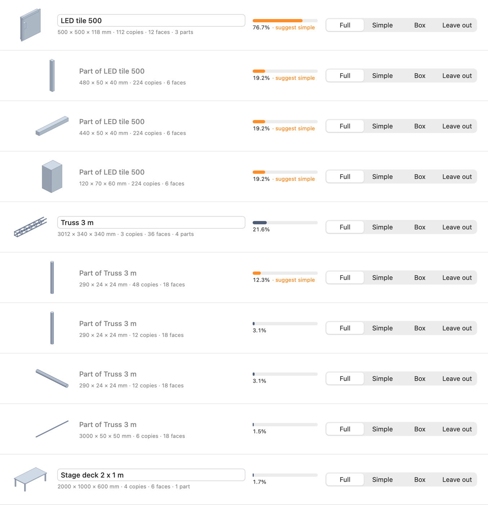
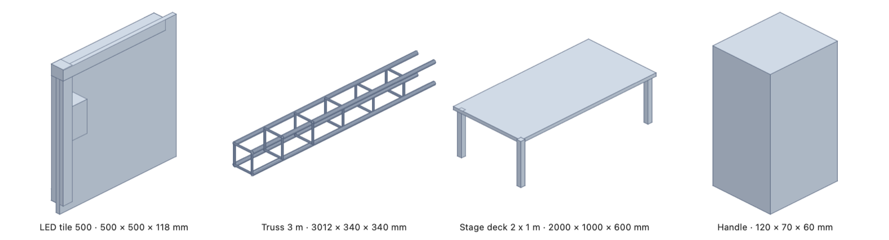
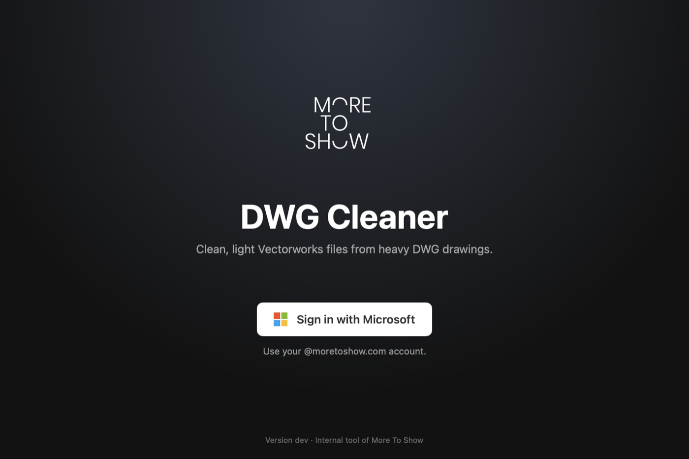

# More To Show - DWG Cleaner

**Heavy DWG drawings in, clean Vectorworks files out.** An internal tool of More To Show for
Vectorworks 2025 and 2026 on the Mac.

Suppliers send DWGs from BricsCAD or AutoCAD in which every LED tile, truss section and bracket is its
own nest of groups. Vectorworks then converts every single copy, and none of it becomes a symbol.
DWG Cleaner fixes that before and after the import:

- **Real symbols.** Identical 3D parts and repeated blocks become symbols, so Vectorworks converts each
  shape once instead of hundreds of times, and changing one tile changes them all.
- **You decide the detail.** Before anything goes to Vectorworks you see every symbol with a shaded
  preview, how often it's used and how heavy it is. Keep it exact, make it a light Vectorworks extrude,
  a simple box, or leave it out.
- **Tidy files.** Empty and single-object groups and tiny leftovers are removed; texts, dimensions and
  loci are kept. The original DWG is never touched.
- **Names you give are remembered.** Name the LED tile once; the next drawing with the same tile gets
  your name automatically.

## Name every symbol before it reaches Vectorworks

## Only for More To Show

The app opens with a sign-in: only @moretoshow.com accounts can use it.

## Get it

- **[Download the latest version](https://github.com/MoreToShow/dwg-cleaner-releases/releases/latest)**
  and drag it to Applications. It needs a Mac with Apple silicon (macOS 14 or later), Vectorworks 2025
  or 2026 and the free ODA File Converter. The app offers the download if it's missing.
- **[User manual (PDF)](DWG-Cleaner-Manual.pdf)**: installing, signing in, converting a drawing, the options.
- Once installed, the app **updates itself**: it checks once a day and offers each new version.

`appcast.xml` is the update feed the app checks. The images show a made-up demo stage. The source
code is private.
